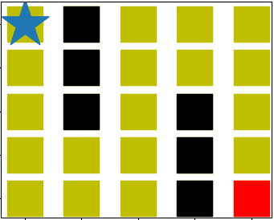

# RL-maze-runner
It is a classical example of Q-learning by neural network, illustrated by an simple environment of a 5 x 5 maze, in which an agent needs to navigate through the obstacles and find the shortest path to the goal. Tensorflow is used in this project. Discussion of hyper-parameters is included.

## Goal

  

 <b> Figure 1. The maze </b> 

_Figure 1_ shows the 5 x 5 maze we use in this project. The yellow squares are the viable path that the agent is allowed to step on. The black squares are the obstacles that the agent must learn to **avoid** stepping on . Red square represents the goal. The agent starts at the initial location (marked as the blue star in the maze) and learns to find its shortest route to the goal (red square), while escaping the obstacles.

The problem will be solved by Reinforcement Learning with the training rules below:

1. The agent is free to select an action (go up/down/left/right). Each time it selects an action, it changes its location in the selected direction (up/down/left/right).
2. The agent is allowed to step on the obstacles (black squares), however, it will get punished when it does so,  such that it can be trained to avoid the obstacles.
3. The agent gets rewarded when it arrives at the goal (red square).
4. When the agent arrives at the goal, the training episode ends and a new episode starts.

## Method
$\begin{bmatrix}
0 & 1 & 2 & 3 & 4\\
5 & 6 & 7 & 8 & 9\\
10 & 11 & 12 & 13 & 14\\
15 & 16 & 17 & 18 &19 \\
20 & 21 & 22 & 23 & 24
\end{bmatrix}$
