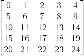
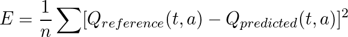

# RL-maze-runner
It is a classical example of Q-learning by neural network, illustrated with an simple environment of a 5 x 5 maze, in which an agent needs to navigate through the obstacles and find the shortest path to the goal. Tensorflow is used in this project. Discussion of hyper-parameters is included.

Codes can be found in the file "Maze_Runner.ipynb" in this repository. Tensorflow is required to run the python script. Implementation details are inspired by [Arthur Juliani's work](https://medium.com/emergent-future/simple-reinforcement-learning-with-tensorflow-part-0-q-learning-with-tables-and-neural-networks-d195264329d0). If you are not familiar with Q-learning, [mnemstudio.org](http://mnemstudio.org/path-finding-q-learning-tutorial.htm) has provided a clear painless tutorial on this topic.

The repository contains files:
1. img/* : Images for this markdown
2. Maze_Runner.ipynb: Jupyter Notebook that contains all the implementation codes

## The Problem Presented

  

 <b> Figure 1. The Maze </b> 

_Figure 1_ shows the 5 x 5 maze we use in this project. The yellow squares are the viable path that the agent is allowed to step on. The black squares are the obstacles that the agent must learn to **avoid** stepping on . Red square represents the goal. The agent starts at the initial location (marked as the blue star in the maze) and learns to find its shortest route to the goal (red square), while escaping the obstacles.

The problem will be solved by Reinforcement Learning with the training rules below:

1. The agent is free to select an action (go up/down/left/right). When it selects an action, it changes its location in the selected direction (up/down/left/right).
2. The agent is allowed to step on the obstacles (black squares), however, it will get punished when it does so,  such that it can be trained to avoid the obstacles.
3. The agent gets rewarded when it arrives at the goal (red square).
4. When the agent arrives at the goal, the training episode ends and a new episode starts.

## Method

In reinforcement learning, we map the input ![X] to the output ![Q] via the transformation ![QWX], in which the input ![X] represents the current state of the agent (its location in the maze), and ![Q] the action choices (turning up/down/left/right). The action choices are denoted by letter ![Q] because it represents the Q-scores for each action - action with higher Q-score indicates a higher predicted future reward. The "Q-score" is a terminology used by Q-learning.

Such formulation of  ![QWX] is attempted to predict the best action ![Q] under the current state of ![X] such that the agent can avoid the obstacles and find the shortest path based on its location. The function ![WX] can be approximated by fully connected neural network via back-propagation, which is trained to optimize the action prediction ![Q] under the state ![X].

  

 <b> Figure 2. State Map </b> 

  

 <b> Figure 3. Reward Map </b> 

Each location in the 5 x 5 grid maze is indexed to the state number, as shown in _Figure 2_. For example, the top-left corner in the maze is indexed to state 0, the bottom-right corner (also the goal) is indexed to state 24. 

Each location (or state) has its reward signal, as shown in the reward map (_Figure 3_). For example, state 1, 6, 11 actually represent the obstacles' location. We want to punish the agent for taking actions that lead to state 1, 6, 11, so it will receive a negative reward (-2500) at those states. The opposite goes for state 24, a positive reward (+500) will be given.

### **Feed-forward**

  

 <b> Figure 4. Neural Network Architecture </b> 

The function ![WX] that maps the current states ![X] to the action choices ![Q] is a neural network. It takes in the (25 x 1) one-hot vector, with 1 at the nth row correponding to the nth state, and with 0 in other rows. The (25 x 1) input is then fed to the 256 units of hidden layer with Relu activation function. Finally the network outputs the predicted future rewards of the four action choices (up/down/left/right).

### **Cost Function - Least Squares and Bellman Equation**

Here comes the essence of Reinforcement Learning.

As usual, we use least squares to fit the predicted ![Q] (predicted expected reward at the current state) to our reference ![Q] (expected reward obtained from the environment).

  

In the above, "n" is only a normalising factor, "a" represents the action. For example, Q(t, a = up) represents the predicted Q-score for going up at time t. The reference Q(t, a) is the tricky part, which can be calculated by the Bellman Equation below. For the explanation of the equation, you may have a look at the [the article by Simonini][article Simonini].
 

  

The Bellman equation simply says that the expected future reward is equal to current reward R(t) plus the maximum predicted future reward discounted by a factor ![gamma]. 

Let's go through the algorithm step by step: 
1. At time t, the agent selects an action "a" (up/down/left/right) and arrives at state X(t). 
2. It then receives a reward R(t) according to the reward map (_Figure_ 3). 
3. Based on the current state X(t), we run the feed-forward calculation and obtain the predicted Q(t+1, all actions) for the next time step. 
4. From the predicted Q(t+1, all actions)  ![Q space], we select the maximum one out of the four, and discount it with a factor of ![gamma]. 
5. Plug in the values and update the reference Q(t, a) via Bellman Equation. Begin the Back-propagation.

One important remark here: In step 1, the agent chooses an action and arrives at the state X(t). The criteria of choosing an action is worth discussing. One of them is the greedy approach - running the feed-forward and choosing the action with the maximal Q-score. However, in the beginning the training has not yet converaged and it will run into a serious looping problem. 

Another method is adding some randomness to the greedy approach - there is a probability (denoted by e) that the agent will choose an action **randomly** out of up/down/left/right. The effects of random/greedy sampling will be further discussed in the later section.

## Results
The agent is trained for 500 episodes. In each episode it will start from state 0 (top-left corner of the maze), select an action and iterate through 100 steps in the maze. Even if the agent steps on state 24 (the goal), the episode will not end until 100 iterations/steps are achieved.

  

Learning rate is fine tuned such that the cost can converage without exploding. In the discussion we will further talk about the observations of how hyper-parameters influence the learning.

  

 <b> Figure 5. Shortest Path Statisfying the Constraints after Training </b> 

As shown in _Figure 5_, the agent follows the path (blue line) which successfully avoid the obstacles (black squares) and arrives at the goal. The sequence of states is [0, 5, 10, 15, 16, 17, 12, 7, 8, 9, 14, 19, 24]. The agent successfully takes the punishments and reward from the far future into account.

  

 <b> Figure 6. Cost at the nth Episode </b> 

## Discussion

1. Reward of the goal has to be larger if it requires many time steps to arrive. This can be illustrated by reducing the reward of the goal (e.g. 100, while maintaing its ratio with the punishment), the agent will fail to find the goal while circulating around the initial local area, because the goal reward is too far away and cannot influence the Q-scores at initial state (discounted too much from many steps ahead).

  

 <b> Figure 7. Different Training Results. The agent follows the optimal route (blue), bypasses obstacles (red) or gets trapped in an infinite loop (magenta).  </b> 

2. Punishment (negative reward) has to be large enough for undesired path (e.g. 5 times more than the goal's). Otherwise the agent will choose the undesired path rather than a long detour (e.g. 17 -> 22 -> 23 -> 24, rather than 17 -> 12 -> 7 -> 8 -> 9 -> 14 -> 19 -> 24, as shown in the red line in _Figure 7_), because positive reward is less discounted in fewer time steps and it attracts the agent to overcome the punishment. This problem can be reproduced by reducing the ratio of punichment to goal's reward, e.g. from (-2500, 500) to (-500, 500). In this case, the agent will bypass the obstacles even with the punishment (_Figure 7_).

3. The above two problems can be also tuned by the hyperparameter - discount rate of future reward ![gamma].

4. During training, action is chosen by the agent either randomly or greedily. Randomness of choosing an action during training (hyperparameter "e", the probaility of random sampling, as opposed to greedy sampling) could greatly influence the training. 
    * If e is too low (e ~ 0), the agent will always choose an action solely based on its prediction. As a result, the agent may get stuck in some infinite loop, bouncing back between two states, as indicated by the magenta line in _Figure 7_. In this case, the Q-scores have not yet converaged and they temporarily indicate that the best action at one of the two states is to go to the another one. 
    * Therefore, we may want a higher e to break away from this infinite loop. On the other hand, if e is too high (e ~ 1), the agent always choose an action randomly, and it may take too long time to reach the goal and require more iterations (slowing down the training). 

5. Ideally, the hyperparameter e should be replaced by some designed strategy to choose an action during training. The strategy should allow the coveragence of interested states and the reach of goal. 
    * Possible approach # 1: At each state, retrieve the past memory of how many times the actions have been taken, and then choose the one with lower frequency. 
    * Possible approach # 2:  Algorithmically design the agent to break the loop if it repeats a particular sequence of steps too many times.

## End

Thanks for following me to that far :).

[X]: img/X.gif
[X onehot]: img/X_onehot.gif
[Q]: img/Q.gif
[Q output]: img/Q_output.gif
[Q space]: img/Q_space.gif
[WX]: img/WX.gif
[QWX]: img/QequalWX.gif
[gamma]: img/gamma.gif
[neural]: img/neural_network.PNG
[article Simonini]: https://medium.freecodecamp.org/an-introduction-to-reinforcement-learning-4339519de419

